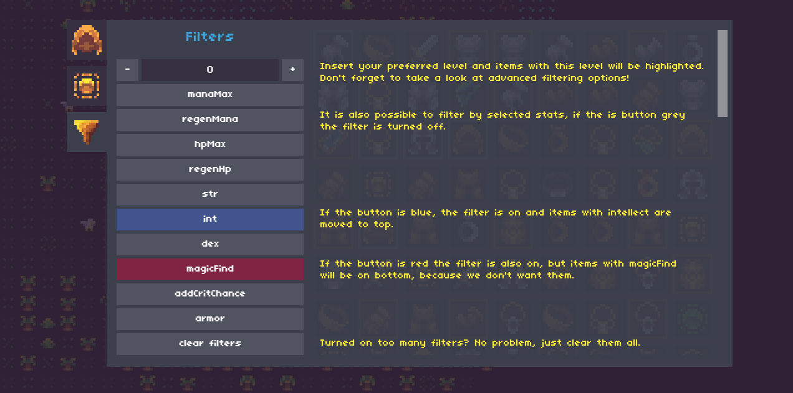

# Isleward PixelDoll
Adds paper doll ui to the Isleward inventory.

Changelog is available [here](changelog.md)

## Usage
1. Install the addon
    * TamperMonkey: Click [this](https://raw.githubusercontent.com/Isleward-Addon-Dev-Group/Pixel-doll-ui/master/Isleward-PixelDoll.user.js) link, click the Install button. (see [Using TamperMonkey](http://isleward.wikia.com/wiki/Loading_Addons_using_TamperMonkey))
2. Reload Isleward
3. Open your inventory

## Advanced filter options
Level input field allows you use few operators for better seraching. Separator is always and only space `' '`.
* `- 10` displays items with level below given level
* `+ 10` displays items with level above given level
* `! 10` hide items with given level
* `-+ 10 5` show items with level between range, third parameter is range and is optional (default is 10)

## How does Pixel Doll filters work?

## Screenshot

